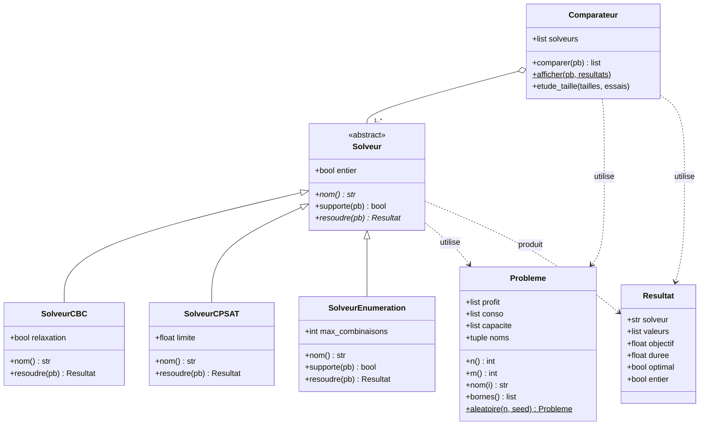

## On teste différents solveurs de COIN-OR 

1. testPulp : problème modélisé par Pulp, utilisant CBC et CLP
2. testPyomo : problème modélisé par pyomo, utilisant Ipopt


## On construit spécifiquement une petite architecture objet pour la comparaison (Pulp/CBC)

# testcoin : comparaison de solveurs COIN-OR et autres

Comparaison de plusieurs méthodes de résolution d'un problème de production
(tables et chaises, généralisé à `n` produits) : CBC via PuLP 4, CP-SAT
d'OR-Tools, relaxation continue et énumération exhaustive.

## Architecture



- `Solveur` est une classe abstraite : `nom` et `resoudre` doivent être
  définis par chaque sous-classe, `supporte` a une implémentation par défaut.
- `Comparateur` ne connaît que `Solveur`, pas les sous-classes : ajouter un
  solveur ne demande aucune modification ailleurs.

## Structure du projet

```
testCOINOR/
├── pyproject.toml
├── uv.lock
└── src/
    └── testcoin/
        ├── __init__.py
        ├── probleme.py      # Probleme, Resultat
        ├── solveurs.py      # Solveur, SolveurCBC, SolveurCPSAT, SolveurEnumeration
        ├── comparateur.py   # Comparateur (comparaison, étude de taille, graphiques)
        └── main.py          # point d'entrée
```

## Prérequis

- Python 3.10 ou plus
- [uv](https://docs.astral.sh/uv/)
- L'exécutable `cbc`, non fourni par PuLP 4 :
  - Debian/Ubuntu : `sudo apt install coinor-cbc`
  - conda : `conda install -c conda-forge coincbc`

## Installation et lancement

```bash
uv sync
uv run testcoin
```

Sans point d'entrée déclaré dans `pyproject.toml` :

```bash
uv run python -m testcoin.main
```

Pour que `uv run testcoin` fonctionne, `pyproject.toml` doit contenir :

```toml
[project.scripts]
testcoin = "testcoin.main:main"
```

## Ce que fait le programme

1. Résout le problème tables et chaises avec chaque solveur et affiche un
   tableau comparatif (solution, profit, temps).
2. Lance une étude selon la taille du problème et trace deux graphiques :
   le temps de calcul de chaque solveur (échelle logarithmique) et l'écart
   entre la relaxation continue et l'optimum entier.

## Ajouter un solveur

Créer une sous-classe de `Solveur` dans `solveurs.py` avec les membres
`nom` et `resoudre(pb) -> Resultat`, puis l'ajouter à la liste passée au
`Comparateur` dans `main.py`.
