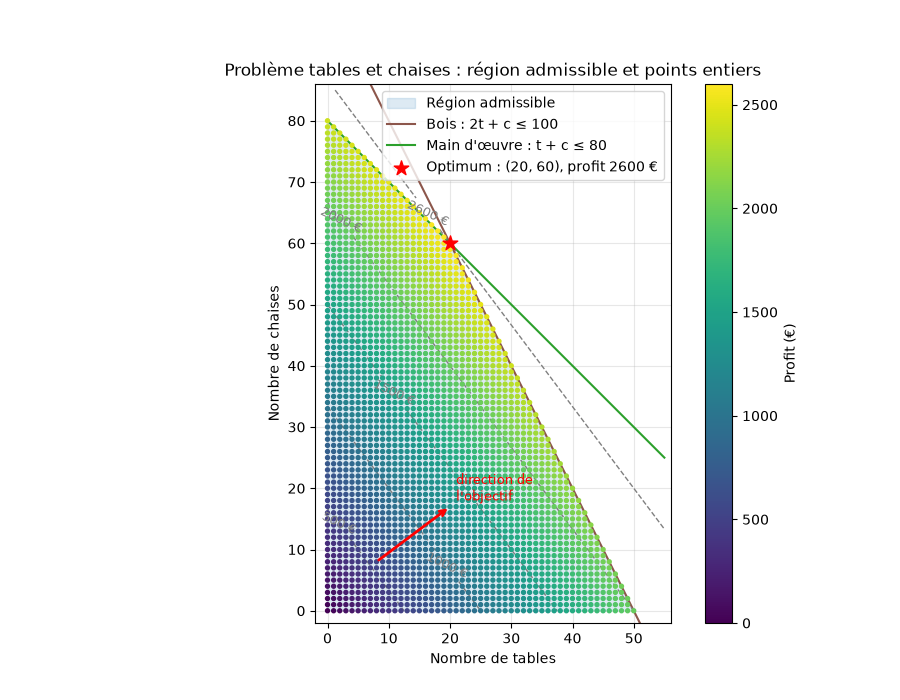
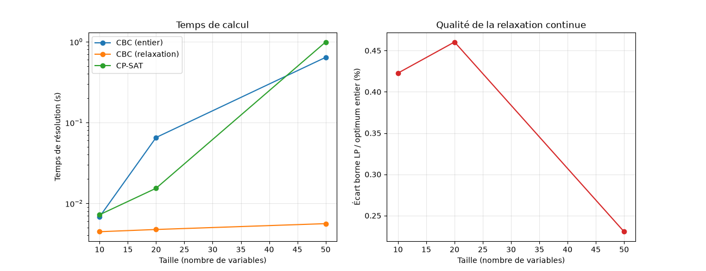
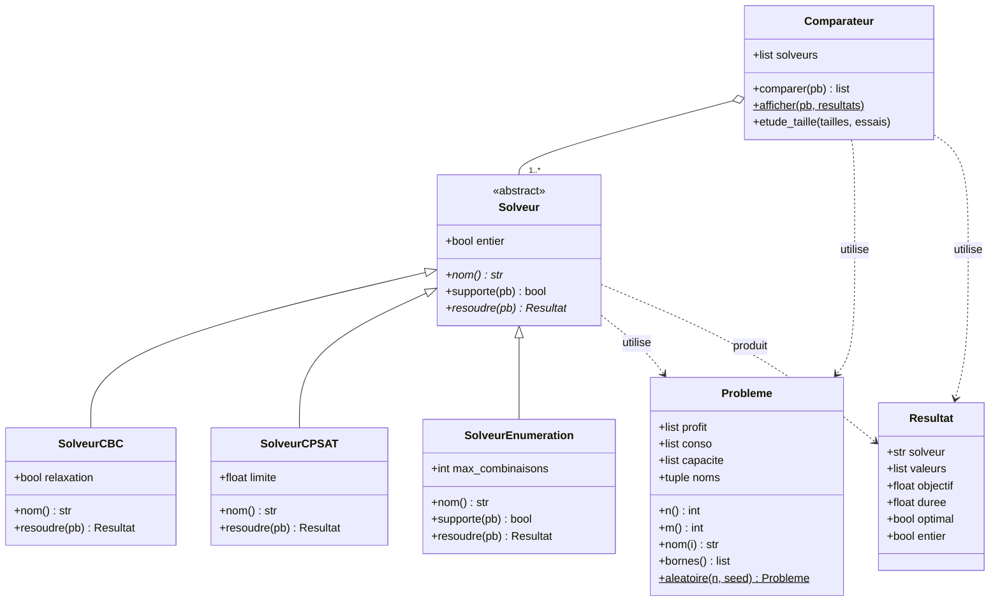

## On teste différents solveurs de COIN-OR (notebooks python)

1. testPulp : problème modélisé par Pulp, utilisant CBC
    - problème de production : $\max 30.0* nbchaises + 40.0*nbtables s.c. nbchaises + 2 nbtables \leq 100, nbchaises + nbtables \leq 80$
  
3. testPyomo : problème modélisé par pyomo, utilisant Ipopt
    - Exemple : $\min x_1+x_3+x_4(x_1+x_2+x_3) s.c. 1\leq x_i \leq 5, x_1*x_2*x_3*x_4 \geq 25 , x_1**2 + x_2**2 + x_3**2 + x_4**2 == 40$


## On construit spécifiquement une petite architecture objet python pour la comparaison en temps (Pulp/CBC) avec un autre solveur (CP-SAT d'OR-Tools)

Comparaison de plusieurs méthodes de résolution d'un problème de production
(tables et chaises, généralisé à `n` produits) : 

1. CBC de coin-OR via PuLP : méthode branch and cut
2. CP-SAT d'OR-Tools (google)
3. relaxation continue : CBC de coin-OR
4. énumération exhaustive.


  


## Architecture



- `Solveur` est une classe abstraite : `nom` et `resoudre` doivent être
  définis par chaque sous-classe, `supporte` a une implémentation par défaut.
- `Comparateur` ne connaît que `Solveur`, pas les sous-classes : ajouter un
  solveur ne demande aucune modification ailleurs.

## Structure du projet

```
testCOINOR/
├── pyproject.toml
├── uv.lock
└── src/
    └── testcoin/
        ├── __init__.py
        ├── probleme.py      # Probleme, Resultat
        ├── solveurs.py      # Solveur, SolveurCBC, SolveurCPSAT, SolveurEnumeration
        ├── comparateur.py   # Comparateur (comparaison, étude de taille, graphiques)
        └── main.py          # point d'entrée
```

## Prérequis

- Python 3.10 ou plus
- [uv](https://docs.astral.sh/uv/)
- L'exécutable `cbc`, 
  - Debian/Ubuntu : `sudo apt install coinor-cbc`

## Installation et lancement

```bash
uv sync
uv run testcoin
```

Sans point d'entrée déclaré dans `pyproject.toml` :

```bash
uv run python -m testcoin.main
```


## Ce que fait le programme

1. Résout le problème tables et chaises avec chaque solveur et affiche un
   tableau comparatif (solution, profit, temps).
2. Lance une étude selon la taille du problème et trace deux graphiques :
   le temps de calcul de chaque solveur (échelle logarithmique) et l'écart
   entre la relaxation continue et l'optimum entier.

## Ajouter un solveur

Créer une sous-classe de `Solveur` dans `solveurs.py` avec les membres
`nom` et `resoudre(pb) -> Resultat`, puis l'ajouter à la liste passée au
`Comparateur` dans `main.py`.
